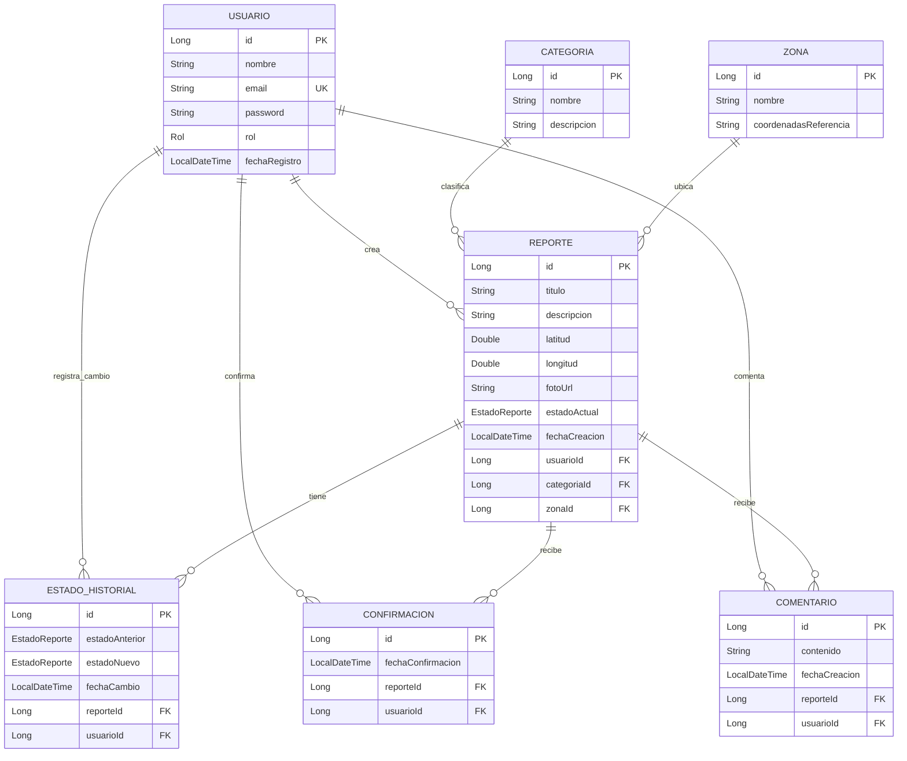

# 🏙️ UrbanFix — Sistema de Reportes de Incidencias Urbanas

## CS 2031 — Desarrollo Basado en Plataforma

### Backend — Proyecto 1

**Integrantes:**

- Rodolfo Elard Huaroc Enciso 202220307
- [Nombre completo del integrante 2]
- [Nombre completo del integrante 3]
- [Nombre completo del integrante 4]
- [Nombre completo del integrante 5]

**Repositorio Backend:** `Urban-fix/Urbanfix-backend`

---

# 📑 Índice

1. [Introducción](#1-introducción)
2. [Identificación del Problema o Necesidad](#2-identificación-del-problema-o-necesidad)
3. [Descripción de la Solución](#3-descripción-de-la-solución)
4. [Tecnologías Utilizadas](#4-tecnologías-utilizadas)
5. [Arquitectura del Sistema](#5-arquitectura-del-sistema)
6. [Modelo de Entidades](#6-modelo-de-entidades)
7. [Manejo de Errores](#7-manejo-de-errores)
8. [Medidas de Seguridad Implementadas](#8-medidas-de-seguridad-implementadas)
9. [Eventos y Asincronía](#9-eventos-y-asincronía)
10. [API REST](#10-api-rest)
11. [Instalación y Ejecución Local](#11-instalación-y-ejecución-local)
12. [Pruebas](#12-pruebas)
13. [Postman](#13-postman)
14. [GitHub y Gestión del Proyecto](#14-github-y-gestión-del-proyecto)
15. [CI/CD y Deployment](#15-cicd-y-deployment)
16. [Conclusiones](#16-conclusiones)
17. [Apéndices](#17-apéndices)

---

# 1. Introducción

## Contexto

Las ciudades presentan constantemente incidencias relacionadas con el mantenimiento de la infraestructura y los servicios públicos, como baches, fallas de alumbrado, acumulación de residuos, deterioro de espacios públicos o problemas relacionados con agua y desagüe.

En muchos casos, los ciudadanos no cuentan con un mecanismo centralizado que permita registrar estas incidencias, conocer su estado o visualizar si otros ciudadanos han reportado el mismo problema.

Por otro lado, las autoridades y responsables municipales necesitan mecanismos que permitan organizar los reportes, clasificarlos, actualizar su estado y mantener un historial de las acciones realizadas.

**UrbanFix** surge como una plataforma que busca facilitar la comunicación entre ciudadanos y responsables de la gestión urbana mediante un sistema centralizado de reportes.

## Objetivos del proyecto

El objetivo principal de UrbanFix es desarrollar un backend capaz de gestionar incidencias urbanas mediante una API REST segura y escalable.

Los objetivos específicos son:

- Permitir el registro y autenticación de usuarios.
- Permitir que los ciudadanos creen reportes de incidencias.
- Asociar cada reporte con una categoría y una zona.
- Almacenar las coordenadas geográficas de cada incidencia.
- Permitir búsquedas y filtros de reportes.
- Permitir que otros ciudadanos confirmen una incidencia.
- Permitir comentarios en los reportes.
- Mantener un historial de cambios de estado.
- Implementar diferentes roles y permisos.
- Enviar notificaciones asociadas a determinados eventos.
- Aplicar una arquitectura organizada que facilite el mantenimiento y testing.

---

# 2. Identificación del Problema o Necesidad

## Descripción del problema

Los problemas urbanos suelen ser reportados mediante diferentes canales, como llamadas, mensajes, redes sociales o atención presencial. Esto puede provocar pérdida de información, duplicidad de reportes y poca visibilidad sobre el progreso de cada incidencia.

Además, un ciudadano normalmente no dispone de una forma sencilla de saber si otro usuario ya informó el mismo problema o si la municipalidad comenzó a atenderlo.

También existe una necesidad administrativa. Los responsables municipales requieren información organizada para clasificar problemas, consultar su ubicación y realizar seguimiento de los cambios realizados.

## Justificación

Centralizar esta información permite mejorar la comunicación entre ciudadanos y responsables municipales.

UrbanFix busca proporcionar un sistema donde los reportes permanezcan registrados y puedan recibir confirmaciones y comentarios de otros usuarios.

Asimismo, el historial de estados permite conservar trazabilidad de la atención de cada incidencia.

La utilización de roles permite separar las acciones que puede realizar un ciudadano de aquellas reservadas para usuarios responsables de administrar o supervisar las incidencias.

---

# 3. Descripción de la Solución

UrbanFix implementa una API REST mediante la cual un cliente frontend puede comunicarse con el backend.

Entre las principales funcionalidades implementadas se encuentran:

- Registro de usuarios.
- Inicio de sesión.
- Access Token mediante JWT.
- Refresh Token.
- Recuperación de contraseña.
- Gestión de roles.
- Creación de reportes.
- Actualización de reportes.
- Eliminación de reportes.
- Consulta individual y general de reportes.
- Consulta detallada de un reporte.
- Filtros por estado, categoría, zona y usuario.
- Búsqueda de reportes.
- Consulta de reportes creados por el usuario autenticado.
- Gestión de categorías.
- Gestión de zonas.
- Confirmaciones de reportes.
- Eliminación de confirmaciones.
- Conteo de confirmaciones.
- Comentarios.
- Eliminación de comentarios.
- Historial de cambios de estado.
- Notificaciones mediante eventos.
- Notificaciones por correo electrónico.
- Manejo global de errores.
- Tests unitarios y de integración.

---

# 4. Tecnologías Utilizadas

| Tecnología | Uso |
|---|---|
| Java 21 | Lenguaje principal |
| Spring Boot | Framework para el backend |
| Spring Web MVC | Implementación de la API REST |
| Spring Data JPA | Persistencia y acceso a datos |
| Hibernate | ORM |
| Spring Security | Autenticación y autorización |
| JWT / JJWT | Manejo de tokens |
| BCrypt | Hash de contraseñas |
| PostgreSQL 16 | Base de datos |
| Maven | Gestión de dependencias y build |
| Lombok | Reducción de código repetitivo |
| Jakarta Validation | Validación de DTOs |
| Spring Mail | Envío de correos |
| Thymeleaf | Plantillas HTML para correos |
| Docker Compose | Base de datos para desarrollo |
| JUnit | Testing |
| Mockito | Pruebas unitarias |
| Testcontainers | Pruebas de integración |
| JaCoCo | Cobertura de pruebas |
| Postman | Documentación y pruebas de API |
| GitHub Actions | Integración continua |

---

# 5. Arquitectura del Sistema

El backend utiliza una arquitectura por capas.

```text
Cliente
   │
   ▼
Controller
   │
   ▼
Service
   │
   ▼
Repository
   │
   ▼
PostgreSQL
```

Las principales responsabilidades son:

### Controller

Recibe las solicitudes HTTP, obtiene los parámetros o DTOs necesarios y delega las operaciones hacia la capa de servicios.

### Service

Contiene la lógica de negocio de la aplicación.

Por ejemplo:

- creación y actualización de reportes;
- validación de operaciones;
- cambio de estados;
- autenticación;
- confirmaciones;
- comentarios.

### Repository

Se encarga del acceso a la base de datos mediante Spring Data JPA.

### DTO

Se utilizan DTOs especializados para evitar exponer directamente las entidades JPA.

El proyecto separa los DTOs en:

```text
dto/
├── request/
└── response/
```

### Mapper

Los mappers realizan la conversión entre entidades y DTOs.

Esta organización ayuda a mantener un bajo acoplamiento y una correcta separación de responsabilidades.

---

# 6. Modelo de Entidades

El sistema contiene más de seis entidades principales relacionadas con la lógica del negocio.




## Usuario

Representa los usuarios registrados.

Principales atributos:

- `id`
- `nombre`
- `apellido`
- `email`
- `password`
- `rol`
- `fechaRegistro`

El correo electrónico es único.

## Reporte

Representa una incidencia urbana.

Contiene:

- `id`
- `titulo`
- `descripcion`
- `latitud`
- `longitud`
- `fotoUrl`
- `fechaCreacion`
- `estadoActual`
- usuario
- categoría
- zona

Además, mantiene relaciones con comentarios, confirmaciones e historial.

## Categoria

Clasifica los tipos de incidencias urbanas.

Ejemplos:

- Alumbrado Público
- Recolección de Basura
- Calzadas y Aceras
- Espacios Públicos
- Señalización
- Agua y Cloacas

## Zona

Representa una zona geográfica donde puede encontrarse una incidencia.

## Comentario

Permite que los usuarios participen en un reporte mediante comentarios.

## Confirmacion

Permite que un usuario indique que una incidencia reportada también ha sido observada por él.

Existe una restricción única sobre:

```text
reporte_id + usuario_id
```

evitando que un usuario confirme dos veces el mismo reporte.

## EstadoHistorial

Registra los cambios de estado de un reporte, almacenando:

- estado anterior;
- estado nuevo;
- fecha del cambio;
- reporte;
- usuario responsable.

## PasswordResetToken

Permite gestionar el proceso de recuperación de contraseña mediante tokens con fecha de expiración.

---

# 7. Manejo de Errores

El backend utiliza excepciones personalizadas y un manejador global de errores.

El objetivo es evitar respuestas inconsistentes y proporcionar al cliente información clara cuando ocurre un error.

Se manejan casos como:

- recursos inexistentes;
- emails duplicados;
- credenciales inválidas;
- operaciones no permitidas;
- confirmaciones duplicadas;
- datos de entrada inválidos;
- coordenadas incorrectas;
- transiciones de estado inválidas;
- acciones sin autorización.

El proyecto utiliza un `GlobalExceptionHandler` para centralizar este comportamiento.

Las respuestas de error utilizan un DTO consistente que incluye información como:

```text
timestamp
status
error
message
path
```

Dependiendo del problema se retornan códigos HTTP como:

```text
400 Bad Request
401 Unauthorized
403 Forbidden
404 Not Found
409 Conflict
500 Internal Server Error
```

---

# 8. Medidas de Seguridad Implementadas

UrbanFix utiliza **Spring Security** para proteger la API.

## JWT

Después de autenticarse, el usuario recibe tokens JWT.

Para acceder a endpoints protegidos se utiliza:

```http
Authorization: Bearer <access_token>
```

El backend incluye:

- generación de tokens;
- validación;
- expiración;
- extracción de información del usuario;
- filtro JWT;
- `UserDetailsService`;
- refresh tokens.

La clave JWT se obtiene mediante variables de entorno y no se almacena directamente en el código.

## Contraseñas

Las contraseñas no se almacenan en texto plano.

Se utiliza:

```text
BCrypt
```

para generar su hash antes de almacenarlas.

## Roles

Los roles existentes son:

```text
CIUDADANO
ADMIN_MUNICIPAL
TECNICO
SUPERVISOR
OPERADOR
AUDITOR
```

Se utiliza `@PreAuthorize` para restringir operaciones sensibles.

Por ejemplo, el cambio de estado de un reporte puede ser realizado por:

```text
ADMIN_MUNICIPAL
TECNICO
SUPERVISOR
```

## Prevención de vulnerabilidades

### SQL Injection

El acceso a la base de datos se realiza mediante Spring Data JPA y queries parametrizadas, reduciendo el riesgo de construir consultas SQL directamente con datos proporcionados por el usuario.

### Validación de datos

Los DTOs utilizan Jakarta Validation mediante anotaciones y `@Valid`.

Esto permite validar las solicitudes antes de procesarlas.

### CSRF

La API utiliza autenticación JWT stateless. Por ello, la configuración de seguridad deshabilita CSRF para este modelo de autenticación.

### CORS

El backend posee configuración CORS. Durante desarrollo admite diferentes orígenes; para producción debe restringirse al dominio real utilizado por el frontend.

### Información sensible

Las credenciales y claves se almacenan mediante variables de entorno y el archivo `.env` no debe incluirse en Git.

---

# 9. Eventos y Asincronía

UrbanFix utiliza eventos para desacoplar determinadas acciones secundarias de la lógica principal.

Un ejemplo es el registro de un usuario:

```text
Registro
   │
   ▼
UsuarioRegistradoEvent
   │
   ▼
EmailNotificationListener
   │
   ▼
Correo de bienvenida
```

También existe un evento relacionado con los cambios de estado:

```text
Cambio de estado
   │
   ▼
EstadoCambiadoEvent
   │
   ▼
EstadoNotificationListener
   │
   ▼
Notificación al ciudadano
```

Los listeners utilizan:

```java
@Async
```

para ejecutar determinadas tareas en otro hilo.

También se utiliza:

```java
@TransactionalEventListener(
    phase = TransactionPhase.AFTER_COMMIT
)
```

Esto permite procesar determinadas notificaciones únicamente después de que la operación principal haya sido confirmada en la base de datos.

El proyecto posee además un `ThreadPoolTaskExecutor` configurado mediante `AsyncConfig`.

La asincronía resulta importante porque tareas como el envío de correos pueden tardar más que una operación normal. Ejecutarlas de manera separada evita bloquear innecesariamente la respuesta HTTP.

---

# 10. API REST

La API utiliza la siguiente ruta base:

```text
/api/v1
```

## Autenticación

| Método | Endpoint |
|---|---|
| POST | `/api/v1/auth/register` |
| POST | `/api/v1/auth/login` |
| POST | `/api/v1/auth/refresh` |
| POST | `/api/v1/auth/password-reset/request` |
| POST | `/api/v1/auth/password-reset/confirm` |

## Reportes

| Método | Endpoint |
|---|---|
| POST | `/api/v1/reportes` |
| GET | `/api/v1/reportes` |
| GET | `/api/v1/reportes/{id}` |
| GET | `/api/v1/reportes/{id}/detalle` |
| GET | `/api/v1/reportes/mis-reportes` |
| PUT | `/api/v1/reportes/{id}` |
| DELETE | `/api/v1/reportes/{id}` |
| PATCH | `/api/v1/reportes/{id}/estado` |

Se permiten filtros como:

```text
?estado=REPORTADO
?categoriaId=1
?zonaId=2
?usuarioId=3
?search=bache
```

## Categorías

| Método | Endpoint |
|---|---|
| POST | `/api/v1/categorias` |
| GET | `/api/v1/categorias` |
| GET | `/api/v1/categorias/{id}` |
| PUT | `/api/v1/categorias/{id}` |
| DELETE | `/api/v1/categorias/{id}` |

## Zonas

| Método | Endpoint |
|---|---|
| POST | `/api/v1/zonas` |
| GET | `/api/v1/zonas` |
| GET | `/api/v1/zonas/{id}` |
| PUT | `/api/v1/zonas/{id}` |
| DELETE | `/api/v1/zonas/{id}` |

## Confirmaciones

Ruta base:

```text
/api/v1/reportes/{reporteId}/confirmaciones
```

| Método | Endpoint |
|---|---|
| POST | `/` |
| DELETE | `/` |
| GET | `/` |
| GET | `/conteo` |
| GET | `/verificar` |

## Comentarios

Ruta base:

```text
/api/v1/reportes/{reporteId}/comentarios
```

| Método | Endpoint |
|---|---|
| POST | `/` |
| GET | `/` |
| DELETE | `/{comentarioId}` |

---

# 11. Instalación y Ejecución Local

## Requisitos

Es necesario tener instalado:

- Git
- Java 21
- Docker
- Docker Compose

## Clonar el repositorio

```bash
git clone https://github.com/Urban-fix/Urbanfix-backend.git
cd Urbanfix-backend
```

Para utilizar la rama de desarrollo:

```bash
git checkout develop
```

## Configurar variables de entorno

Crear `.env` a partir de `.env.example`.

### Windows PowerShell

```powershell
Copy-Item .env.example .env
```

### Linux/macOS

```bash
cp .env.example .env
```

Ejemplo:

```env
DB_HOST=localhost
DB_PORT=5432
DB_NAME=urbanfix
DB_USER=urbanfix_user
DB_PASSWORD=urbanfix_local_pass

JWT_SECRET=your_base64_encoded_jwt_secret
JWT_EXPIRATION_ACCESS=900000
JWT_EXPIRATION_REFRESH=604800000

PASSWORD_RESET_TOKEN_EXPIRATION_MINUTES=15

MAIL_HOST=smtp.gmail.com
MAIL_PORT=587
MAIL_USERNAME=
MAIL_PASSWORD=
```

No se deben subir credenciales reales al repositorio.

## Levantar PostgreSQL

```bash
docker compose up -d
```

Comprobar:

```bash
docker ps
```

El contenedor debería aparecer como:

```text
urbanfix-db
```

## Ejecutar el backend

### Windows

```powershell
.\mvnw.cmd spring-boot:run
```

### Linux/macOS

```bash
./mvnw spring-boot:run
```

La API estará disponible por defecto en:

```text
http://localhost:8080
```

---

# 12. Pruebas

El proyecto contiene pruebas unitarias y pruebas de integración.

Los servicios evaluados incluyen:

- AuthService
- ReporteService
- CategoriaService
- ZonaService
- ComentarioService
- ConfirmacionService

También existen pruebas de integración para diferentes controllers.

Para ejecutar las pruebas:

### Windows

```powershell
.\mvnw.cmd test
```

### Linux/macOS

```bash
./mvnw test
```

Para realizar una verificación completa:

```bash
mvn clean verify
```

JaCoCo permite generar información sobre la cobertura de las pruebas.

---

# 13. Postman

El repositorio incluye:

```text
postman/
├── UrbanFix.postman_collection.json
└── UrbanFix.postman_environment.json
```

Estos archivos permiten importar la API en Postman y probar los diferentes endpoints.

El flujo recomendado es:

```text
Registro
   ↓
Login
   ↓
Obtener JWT
   ↓
Crear reporte
   ↓
Consultar reporte
   ↓
Confirmar / comentar
   ↓
Cambiar estado
```

---

# 14. GitHub y Gestión del Proyecto

Durante el desarrollo se utilizó Git y GitHub para gestionar el código fuente.

La estrategia de ramas utilizada sigue una estructura similar a:

```text
main
  ↑
develop
  ↑
feature/*
```

`develop` se utiliza como rama de integración de las funcionalidades desarrolladas.

Cada integrante trabaja en ramas específicas antes de integrar sus cambios.

Un flujo típico es:

```bash
git checkout develop
git pull origin develop
git checkout -b feature/nueva-funcionalidad
```

Después de implementar:

```bash
git add .
git commit -m "feat: descripcion de la funcionalidad"
git push origin feature/nueva-funcionalidad
```

Posteriormente, los cambios pueden integrarse a `develop` mediante Pull Requests.

### Gestión de tareas

**Completar esta parte según lo realizado realmente por el equipo:**

> El equipo utilizó [GitHub Projects / Issues / otra herramienta] para distribuir las tareas del proyecto. Las funcionalidades fueron asignadas entre los integrantes y se realizaron seguimientos de las tareas pendientes y completadas.

> Si no utilizaron GitHub Projects, reemplazar este párrafo indicando la herramienta real utilizada para organizar el trabajo.

---

# 15. CI/CD y Deployment

El proyecto utiliza GitHub Actions para automatizar el proceso de integración continua.

El workflow:

```text
.github/workflows/ci.yml
```

se ejecuta ante cambios en:

```text
develop
main
```

El flujo incluye:

```text
Checkout
   ↓
JDK 21
   ↓
PostgreSQL 16
   ↓
mvn clean verify
   ↓
Build JAR
   ↓
Artifact
```

También existe:

```text
.github/workflows/deploy.yml
```

que genera un paquete preparado para deployment.

Actualmente, la configuración definitiva del servidor de producción todavía se encuentra pendiente.

### URL de producción

```text
Pendiente de deployment.
```

Cuando el sistema sea desplegado, reemplazar por:

```text
https://URL-DEL-BACKEND
```

---

# 16. Conclusiones

## Logros del proyecto

UrbanFix permitió implementar un backend completo para gestionar incidencias urbanas mediante una arquitectura organizada y una API REST.

Entre los principales logros se encuentran:

- autenticación mediante JWT;
- autorización basada en roles;
- persistencia con PostgreSQL;
- CRUD de reportes;
- filtros y búsquedas;
- comentarios y confirmaciones;
- historial de estados;
- eventos;
- procesamiento asíncrono;
- servicio de correo;
- manejo global de errores;
- testing automatizado;
- integración continua.

## Aprendizajes clave

El desarrollo del proyecto permitió aplicar conceptos fundamentales del desarrollo backend como:

- diseño de APIs REST;
- separación por capas;
- persistencia mediante ORM;
- DTOs y mappers;
- inyección de dependencias;
- autenticación y autorización;
- programación basada en eventos;
- asincronía;
- testing;
- Docker;
- trabajo colaborativo mediante Git.

También permitió comprender la importancia de separar las responsabilidades y proteger correctamente las operaciones sensibles de una aplicación.

## Trabajo futuro

Como posibles mejoras futuras se consideran:

- completar el deployment del backend;
- desplegar PostgreSQL en una infraestructura cloud;
- restringir CORS al dominio del frontend;
- incorporar Swagger/OpenAPI;
- agregar paginación;
- mejorar filtros geográficos;
- permitir subida real de fotografías;
- almacenamiento de archivos mediante servicios cloud;
- mejorar el sistema de notificaciones;
- aumentar la cobertura de pruebas;
- incorporar métricas y monitoreo.

---

# 17. Apéndices

## Licencia

**Pendiente de definir por el equipo.**

Si el proyecto utiliza una licencia específica, indicar por ejemplo:

```text
MIT License
```

y agregar el archivo `LICENSE` correspondiente al repositorio.

## Referencias

Para el desarrollo se utilizaron principalmente las siguientes tecnologías y su documentación oficial:

- Spring Boot Documentation.
- Spring Security Documentation.
- Spring Data JPA Documentation.
- PostgreSQL Documentation.
- Docker Documentation.
- JJWT Documentation.
- JUnit Documentation.
- Mockito Documentation.
- Testcontainers Documentation.
- Postman Learning Center.
- GitHub Actions Documentation.

---

## Estado actual del proyecto

```text
✅ API REST
✅ PostgreSQL
✅ Docker Compose
✅ Arquitectura Controller → Service → Repository
✅ DTOs
✅ Mappers
✅ JWT
✅ Refresh Token
✅ BCrypt
✅ Roles
✅ CRUD de reportes
✅ Categorías
✅ Zonas
✅ Comentarios
✅ Confirmaciones
✅ Historial de estados
✅ Recuperación de contraseña
✅ Eventos personalizados
✅ Procesamiento asíncrono
✅ Email y plantillas HTML
✅ Excepciones personalizadas
✅ Global Exception Handler
✅ Tests unitarios
✅ Tests de integración
✅ JaCoCo
✅ Postman Collection
✅ GitHub Actions
🟡 Deployment de producción pendiente
```

---

# UrbanFix 🏙️

**Plataforma colaborativa para el reporte y seguimiento de incidencias urbanas.**
