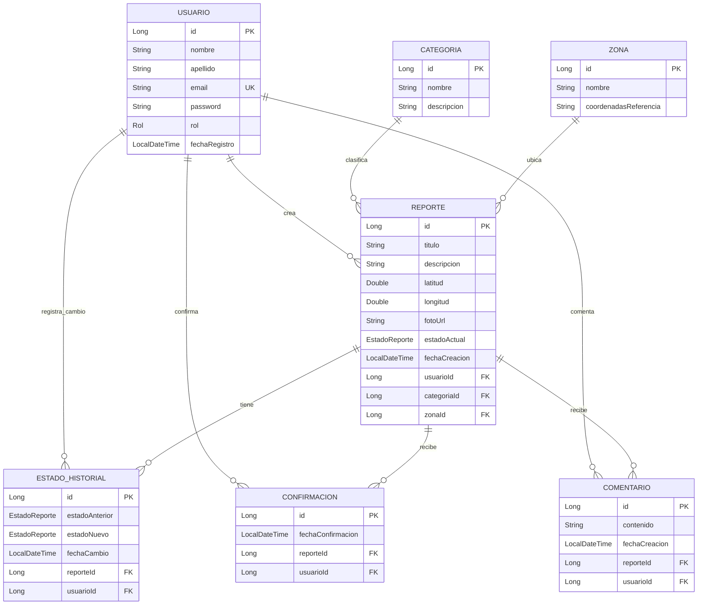

# UrbanFix: Sistema de Reporte de Problemas Urbanos

## Curso
CS 2031 Desarrollo Basado en Plataforma

## Integrantes
- Sabino Guardian Marco Antonio
- Huaroc Enciso Rodolfo Elard
- Centti Torres Edmundo Andre

---

## Índice

1. [Introducción](#introducción)
2. [Identificación del Problema o Necesidad](#identificación-del-problema-o-necesidad)
3. [Descripción de la Solución](#descripción-de-la-solución)
4. [Modelo de Entidades](#modelo-de-entidades)
5. [Manejo de Errores](#manejo-de-errores)
6. [Medidas de Seguridad Implementadas](#medidas-de-seguridad-implementadas)
7. [Eventos y Asincronía](#eventos-y-asincronía)
8. [GitHub & Management](#github--management)
9. [Conclusión](#conclusión)
10. [Apéndices](#apéndices)

---

## Introducción

### Contexto

Las áreas urbanas enfrentan constantemente desafíos relacionados con la infraestructura pública, servicios municipales y mantenimiento general. Baches en las calles, iluminación defectuosa, problemas de recolección de basura, señalización dañada y otras incidencias urbanas afectan la calidad de vida de los ciudadanos. Tradicionalmente, el reporte de estos problemas depende de llamadas telefónicas, correos electrónicos o visitas presenciales a oficinas municipales, procesos que suelen ser lentos, burocráticos y poco transparentes.

La digitalización de los servicios ciudadanos se ha convertido en una prioridad para las administraciones públicas modernas. Los ciudadanos esperan poder reportar problemas de manera rápida, sencilla y a través de dispositivos móviles. Simultáneamente, las municipalidades requieren herramientas eficientes para gestionar, priorizar y dar seguimiento a estos reportes, optimizando el uso de recursos públicos y mejorando la respuesta a la comunidad.

### Objetivos del Proyecto

UrbanFix tiene como objetivo principal desarrollar una plataforma tecnológica que facilite el reporte y gestión de problemas urbanos. Los objetivos específicos incluyen:

- **Democratizar el reporte de problemas**: Permitir que cualquier ciudadano pueda reportar incidencias urbanas de manera sencilla a través de una aplicación móvil o web.
- **Mejorar la transparencia**: Proporcionar visibilidad sobre el estado de los reportes y las acciones tomadas por las autoridades.
- **Optimizar la gestión municipal**: Ofrecer a las autoridades herramientas para clasificar, priorizar y asignar recursos de manera eficiente.
- **Fomentar la participación ciudadana**: Implementar mecanismos de confirmación y comentarios que permitan a la comunidad validar y dar seguimiento a los problemas reportados.
- **Garantizar la seguridad y privacidad**: Implementar medidas robustas de autenticación, autorización y protección de datos.

---

## Identificación del Problema o Necesidad

### Descripción del Problema

El problema central que aborda UrbanFix es la ineficiencia en los canales tradicionales de reporte de problemas urbanos. Los ciudadanos enfrentan múltiples barreras: desconocimiento de los canales oficiales, falta de seguimiento a sus reportes, ausencia de feedback sobre las acciones tomadas, y la sensación de que sus reportes no tienen impacto real. Por otro lado, las municipalidades luchan con la gestión manual de reportes, la falta de priorización basada en datos, la duplicación de reportes del mismo problema, y la incapacidad de medir el desempeño de los servicios públicos.

Esta desconexión entre ciudadanos y autoridades genera frustración, desconfianza en las instituciones públicas y una percepción de abandono de los espacios urbanos. Los problemas persisten por períodos prolongados, afectando la seguridad, la movilidad y la calidad de vida en las comunidades.

### Justificación

La solución de este problema es relevante por múltiples razones. Primero, mejora directamente la calidad de vida de los ciudadanos al facilitar la resolución rápida de problemas urbanos. Segundo, optimiza el uso de recursos públicos al permitir que las municipalidades prioricen problemas basándose en datos reales y confirmaciones ciudadanas. Tercero, fortalece la democracia participativa al empoderar a los ciudadanos para que sean activos en el cuidado de su entorno. Cuarto, proporciona métricas y datos que pueden informar decisiones de política pública y planificación urbana a largo plazo.

La tecnología actual permite implementar soluciones robustas, escalables y accesibles que pueden transformar radicalmente la relación entre ciudadanos y gobierno en el contexto urbano.

---

## Descripción de la Solución

### Funcionalidades Implementadas

UrbanFix Backend implementa las siguientes funcionalidades principales:

**Gestión de Usuarios y Autenticación**
- Sistema de registro de usuarios con validación de email único
- Autenticación mediante JWT (JSON Web Tokens) con tokens de acceso y refresh
- Gestión de roles: CIUDADANO, ADMIN_MUNICIPAL, TECNICO, SUPERVISOR, OPERADOR, AUDITOR
- Recuperación de contraseña mediante tokens temporales enviados por email
- Perfil de usuario con información personal y rol asignado

**Gestión de Reportes**
- Creación de reportes con título, descripción, coordenadas geográficas y foto
- Clasificación de reportes por categorías (ej: infraestructura, iluminación, limpieza)
- Ubicación de reportes por zonas geográficas
- Flujo de estados: REPORTADO → EN_PROCESO → RESUELTO/RECHAZADO
- Historial completo de cambios de estado con auditoría
- Filtros por categoría, zona y estado actual

**Participación Ciudadana**
- Sistema de confirmaciones: los ciudadanos pueden confirmar que un problema existe (evita reportes falsos)
- Restricción de una confirmación por usuario por reporte
- Sistema de comentarios para discutir y dar seguimiento a los reportes
- Listado de reportes creados por el usuario actual

**Gestión Administrativa**
- CRUD completo de categorías y zonas (restringido a roles administrativos)
- Cambio de estado de reportes con validación de transiciones válidas
- Auditoría de quién realizó cada cambio de estado
- Consulta de reportes con múltiples filtros

**Notificaciones**
- Email de bienvenida al registrarse nuevo usuario
- Notificaciones asíncronas de cambios de estado en reportes
- Sistema configurable para habilitar/deshabilitar envío de emails

### Tecnologías Utilizadas

**Backend Framework**
- **Spring Boot 4.1.1**: Framework principal para la aplicación, proporciona configuración automática, dependencias y estructura de proyecto
- **Java 21**: Lenguaje de programación con características modernas como records, pattern matching y switch expressions
- **Spring Data JPA**: Para la persistencia de datos y abstracción de la base de datos
- **Spring Security**: Para autenticación y autorización basada en roles
- **Spring Validation**: Para validación de datos de entrada

**Base de Datos**
- **PostgreSQL 16**: Sistema de base de datos relacional utilizado para almacenamiento persistente
- **Hibernate**: ORM (Object-Relational Mapping) para mapeo entre entidades Java y tablas de base de datos
- **Docker Compose**: Para orquestación local de la base de datos PostgreSQL

**Seguridad**
- **JWT (JJWT 0.12.3)**: Para generación y validación de tokens de autenticación
- **BCrypt**: Para hasheo seguro de contraseñas
- **Spring Security**: Para configuración de filtros de seguridad, CORS y gestión de sesiones

**Testing**
- **JUnit 5**: Framework de testing unitario
- **Mockito**: Para mocking de dependencias en tests unitarios
- **TestContainers 1.20.4**: Para tests de integración con contenedores Docker reales de PostgreSQL
- **Spring Boot Test**: Para testing de componentes Spring
- **Jacoco**: Para medición de cobertura de código

**Otras Herramientas**
- **Lombok**: Para reducción de código boilerplate (getters, setters, constructores)
- **Spring DotEnv**: Para gestión de variables de entorno desde archivo .env
- **Spring Boot Mail**: Para envío de emails
- **Thymeleaf**: Para plantillas de email
- **Logstash Logback Encoder**: Para logging estructurado en formato JSON

**DevOps**
- **GitHub Actions**: Para CI/CD automatizado (build, test, deploy)
- **Maven**: Para gestión de dependencias y ciclo de vida del proyecto
- **Postman**: Para documentación y testing de la API REST

---

## Modelo de Entidades

### Diagrama Entidad-Relación



### Descripción de Entidades

**Usuario**
Representa a los usuarios del sistema. Contiene información personal (nombre, apellido), credenciales de autenticación (email único, password hasheada), rol dentro del sistema y fecha de registro. Los roles determinan los permisos del usuario: CIUDADANO puede crear reportes y confirmar, ADMIN_MUNICIPAL puede gestionar categorías y cambiar estados, TECNICO puede actualizar reportes en proceso, SUPERVISOR tiene visión general, OPERADOR gestiona operaciones diarias, y AUDITOR revisa el sistema.

**Reporte**
Entidad central del sistema que representa un problema urbano reportado. Incluye título descriptivo, detalle del problema, coordenadas geográficas (latitud/longitud), URL de foto opcional, estado actual del reporte, fecha de creación y relaciones con el usuario creador, categoría y zona. El estado sigue un flujo controlado: REPORTADO (inicial), EN_PROCESO (cuando se está trabajando), RESUELTO (cuando se solucionó) o RECHAZADO (cuando no procede).

**Categoria**
Clasifica los reportes por tipo de problema (ej: "Baches", "Iluminación", "Limpieza", "Señalización"). Permite filtrar y agrupar reportes para análisis y asignación a departamentos específicos.

**Zona**
Representa áreas geográficas del municipio (barrios, distritos). Permite ubicar reportes geográficamente y asignarlos a equipos de trabajo regionales. Puede incluir coordenadas de referencia para delimitación del área.

**EstadoHistorial**
Registra auditoría de cambios de estado en los reportes. Cada vez que cambia el estado de un reporte, se crea un registro con el estado anterior, el nuevo estado, fecha del cambio, el reporte afectado y el usuario que realizó el cambio. Esto garantiza trazabilidad completa y responsabilidad en las decisiones.

**Confirmacion**
Tiene como propósito validar que un reporte es real. Los ciudadanos pueden confirmar reportes de otros usuarios para evitar reportes falsos o duplicados. La restricción de unicidad (reporte_id + usuario_id) evita que un mismo usuario confirme múltiples veces el mismo reporte.

**Comentario**
Permite la discusión alrededor de un reporte. Los usuarios pueden agregar comentarios para proporcionar información adicional, hacer preguntas o dar seguimiento. Los comentarios se ordenan cronológicamente y están asociados a un reporte y al usuario que los creó.

---

## Manejo de Errores

El sistema implementa un manejo robusto de errores mediante excepciones personalizadas y un manejador global centralizado. Esta arquitectura garantiza respuestas consistentes y apropiadas ante diferentes tipos de errores, mejorando la experiencia del desarrollador y del usuario final.

### Excepciones Personalizadas

Se implementaron 16 excepciones personalizadas que extienden `RuntimeException`:

- **UsuarioNotFoundException**: Se lanza cuando se intenta acceder a un usuario que no existe (código HTTP 404)
- **EmailAlreadyExistsException**: Se lanza al intentar registrar un usuario con un email ya registrado (código HTTP 409)
- **InvalidCredentialsException**: Se lanza cuando las credenciales de login son incorrectas (código HTTP 401)
- **ReporteNotFoundException**: Se lanza cuando se busca un reporte inexistente (código HTTP 404)
- **CategoriaNotFoundException**: Se lanza cuando se referencia una categoría inexistente (código HTTP 404)
- **ZonaNotFoundException**: Se lanza cuando se referencia una zona inexistente (código HTTP 404)
- **InvalidCoordinatesException**: Se lanza cuando las coordenadas geográficas están fuera de rangos válidos (código HTTP 400)
- **EstadoTransicionInvalidaException**: Se lanza cuando se intenta una transición de estado no permitida (código HTTP 400)
- **ConfirmacionDuplicadaException**: Se lanza cuando un usuario intenta confirmar el mismo reporte dos veces (código HTTP 409)
- **UnauthorizedActionException**: Se lanza cuando un usuario intenta realizar una acción sin permisos (código HTTP 403)
- **ConfirmacionNotFoundException**: Se lanza cuando se busca una confirmación inexistente (código HTTP 404)
- **DatabaseConstraintViolationException**: Se lanza cuando hay violación de restricciones de base de datos (código HTTP 400)
- **FileUploadException**: Se lanza cuando hay errores en la subida de archivos (código HTTP 400)
- **InvalidTokenException**: Se lanza cuando el token JWT es inválido (código HTTP 401)
- **TokenExpiredException**: Se lanza cuando el token JWT ha expirado (código HTTP 401)
- **ServiceException**: Excepción genérica para errores de servicio no específicos (código HTTP 500)

### GlobalExceptionHandler

El `GlobalExceptionHandler` es una clase anotada con `@RestControllerAdvice` que centraliza el manejo de todas las excepciones. Cada excepción personalizada tiene un método `@ExceptionHandler` que retorna un `ErrorResponseDTO` con información estructurada: timestamp, código HTTP, tipo de error, mensaje descriptivo, path del request y opcionalmente detalles adicionales (como campos de validación fallidos).

Este enfoque garantiza que:
- El código de los controllers permanezca limpio, sin bloques try-catch repetitivos
- Las respuestas de error tengan un formato consistente en toda la API
- Los códigos HTTP sean semánticamente correctos según el tipo de error
- Se capturen errores de validación de Spring (`MethodArgumentNotValidException`) y se retornen con detalles de campos específicos
- Se tenga un catch-all para excepciones genéricas no anticipadas

---

## Medidas de Seguridad Implementadas

### Seguridad de Datos

**Autenticación JWT**
El sistema implementa autenticación basada en JSON Web Tokens (JWT). Cada usuario autenticado recibe un token de acceso (access token) con validez de 15 minutos y un token de refresco (refresh token) con validez de 7 días. Los tokens contienen claims con el email, ID de usuario y rol, firmados con HMAC-SHA256 usando una clave secreta almacenada en variables de entorno. El `JwtAuthenticationFilter` intercepta cada request, valida el token y establece el contexto de seguridad de Spring.

**Hasheo de Contraseñas**
Las contraseñas nunca se almacenan en texto plano. Se utiliza BCrypt, un algoritmo de hasheo diseñado específicamente para contraseñas que incluye un salt aleatorio y es resistente a ataques de fuerza bruta y rainbow tables. Cada contraseña tiene un salt único, por lo que dos contraseñas iguales producen hashes diferentes.

**Autorización por Roles**
Spring Security con `@EnableMethodSecurity` permite el uso de `@PreAuthorize` en los endpoints para controlar acceso basado en roles. Por ejemplo, solo usuarios con rol ADMIN_MUNICIPAL pueden cambiar el estado de un reporte, mientras que cualquier usuario autenticado puede crear reportes. Los roles se almacenan como enum en la base de datos y se incluyen en el token JWT para validación rápida.

**Separación de DTOs**
Se implementa un patrón DTO (Data Transfer Object) que separa las entidades de base de datos de las respuestas de la API. Los DTOs de respuesta nunca exponen información sensible como contraseñas, y los DTOs de solicitud validan los datos de entrada antes de procesarlos.

**Variables de Entorno**
Toda información sensible (contraseñas de base de datos, clave secreta JWT, credenciales de email) se almacena en variables de entorno mediante archivo `.env` (no versionado en Git). El archivo `.env.example` sirve como plantilla con valores de ejemplo.

### Prevención de Vulnerabilidades

**Protección contra Inyección SQL**
Spring Data JPA y Hibernate utilizan automáticamente consultas parametrizadas (prepared statements), eliminando el riesgo de inyección SQL. Las consultas personalizadas con `@Query` también usan parámetros nombrados, nunca concatenación de strings.

**Validación de Entrada**
Se utiliza Bean Validation (JSR 380) con anotaciones como `@NotNull`, `@Email`, `@Size`, `@Min`, `@Max` en los DTOs de solicitud. Spring valida automáticamente estos campos antes de que lleguen a la lógica de negocio, rechazando requests malformados.

**CORS (Cross-Origin Resource Sharing)**
Se configura una política CORS que restringe los orígenes permitidos (actualmente configurado para desarrollo con `*`, pero debe restringirse al dominio del frontend en producción). Esto previene que sitios web no autorizados realicen requests a la API.

**CSRF (Cross-Site Request Forgery)**
Se deshabilita CSRF porque la API es stateless (no usa sesiones) y utiliza tokens JWT en el header Authorization, lo que hace que los ataques CSRF no sean aplicables. Para APIs REST con JWT, CSRF no es una amenaza relevante.

**Rate Limiting (Futuro)**
Aunque no implementado en el MVP, se recomienda agregar rate limiting para prevenir ataques de fuerza bruta en endpoints de login y para evitar abuso de la API.

**Sanitización de Datos**
Los campos de texto (título, descripción, comentarios) se validan por longitud máxima para prevenir ataques de denegación de servicio mediante payloads excesivamente grandes. Thymeleaf, utilizado para plantillas de email, escapa automáticamente el contenido HTML previniendo XSS en emails.

---

## Eventos y Asincronía

### Eventos Implementados

El sistema implementa un patrón de eventos desacoplados para manejar operaciones que no deben bloquear el flujo principal de la aplicación. Se implementaron tres eventos principales:

**UsuarioRegistradoEvent**
Se dispara cuando un nuevo usuario se registra exitosamente en el sistema. Este evento contiene la entidad Usuario recién creada y es publicado por el `AuthServiceImpl` después de guardar el usuario en la base de datos.

**EstadoCambiadoEvent**
Se dispara cuando cambia el estado de un reporte. Contiene el reporte afectado, el estado anterior y el nuevo estado. Es publicado por el `EstadoHistorialServiceImpl` después de registrarhistorial del cambio en la base de datos.

**ReporteCreadoEvent**
Se dispara cuando se crea un nuevo reporte. Contiene el reporte recién creado y puede ser utilizado para notificaciones o análisis en tiempo real.

### Listeners Asíncronos

**EmailNotificationListener**
Escucha el evento `UsuarioRegistradoEvent` y envía un email de bienvenida al nuevo usuario. Está anotado con `@Async`, lo que significa que se ejecuta en un hilo separado del hilo principal de la aplicación. También utiliza `@TransactionalEventListener(phase = TransactionPhase.AFTER_COMMIT)`, garantizando que el email solo se envíe si la transacción de registro del usuario se confirma exitosamente.

**EstadoNotificationListener**
Escucha el evento `EstadoCambiadoEvent` y puede enviar notificaciones a usuarios interesados en el reporte. Similar al listener de email, opera de manera asíncrona y solo después de confirmar la transacción.

### Importancia de la Asincronía

La implementación asíncrona de estos eventos es crítica por varias razones:

**No Bloquear el Flujo Principal**
El envío de emails es una operación que puede tardar varios segundos dependiendo del servidor SMTP y la conectividad de red. Si fuera síncrono, el usuario que se registra tendría que esperar a que el email se envíe antes de recibir la respuesta de éxito. Con asincronía, la respuesta es inmediata y el email se envía en segundo plano.

**Resiliencia**
Si el servicio de email falla (servidor SMTP caído, problemas de red), la operación principal (registro de usuario, cambio de estado) no se ve afectada. El error del email se puede manejar separadamente, quizás reintentando más tarde o registrando el fallo para revisión manual.

**Escalabilidad**
La aplicación puede manejar más requests concurrentes porque las operaciones pesadas (envío de emails) no consumen hilos del pool principal. El `AsyncConfig` configura un `ThreadPoolTaskExecutor` personalizado con tamaño de pool configurable, permitiendo ajustar la capacidad según las necesidades.

**Consistencia Transaccional**
El uso de `@TransactionalEventListener(phase = AFTER_COMMIT)` garantiza que los eventos solo se procesen si la transacción de base de datos tiene éxito. Esto evita enviar emails de bienvenida a usuarios que no se guardaron correctamente, o notificar cambios de estado que no se aplicaron.

**Separación de Responsabilidades**
El patrón de eventos desacopla la lógica de negocio principal (crear usuario, cambiar estado) de las operaciones secundarias (enviar emails, notificaciones). Esto hace el código más mantenible y facilita agregar nuevos listeners en el futuro sin modificar el código existente.

---

## GitHub & Management

### Gestión de Proyectos con GitHub

El proyecto sigue una metodología de desarrollo basada en Git Flow con ramas feature para cada funcionalidad. Aunque no se utilizó GitHub Projects formalmente, se adoptó una disciplina de issues y pull requests para organizar el trabajo:

**Estrategia de Ramas**
- `main`: Rama de producción, solo recibe merges de `develop` después de completar features
- `develop`: Rama de integración donde se fusionan las features completadas
- `feature/*`: Ramas para desarrollo de funcionalidades específicas (ej: `feature/auth-jwt`, `feature/eventos-async`, `feature/testing`)

**Pull Requests**
Cada feature se desarrolla en su rama y se integra a `develop` mediante Pull Request. Los PRs requieren revisión de código antes de merge, garantizando calidad y compartiendo conocimiento entre el equipo. Los commits siguen el formato conventional commits (`feat:`, `fix:`, `chore:`) para claridad.

**Issues**
Se utilizaron issues para rastrear tareas, bugs y mejoras. Cada issue estaba asignado a un miembro del equipo con etiquetas de prioridad y tipo (feature, bug, documentation). Los issues se referenciaban en los commits y PRs para trazabilidad.

### GitHub Actions

El proyecto implementa CI/CD automatizado mediante GitHub Actions con dos workflows principales:

**CI Workflow (.github/workflows/ci.yml)**
Se ejecuta en cada push a las ramas `develop` y `main`, y en cada Pull Request hacia estas ramas. El workflow realiza:

1. **Checkout del código**: Utiliza `actions/checkout@v4` para obtener el código del repositorio
2. **Setup de JDK 21**: Configura Java 21 con distribución Temurin y cache de Maven para acelerar builds
3. **Ejecución de tests**: Corre `mvn clean verify` que ejecuta todos los tests unitarios y de integración con TestContainers
4. **Variables de entorno**: Configura las variables necesarias para tests (base de datos PostgreSQL, JWT secret, configuración de email)
5. **Servicio PostgreSQL**: Inicia un contenedor PostgreSQL 16 como servicio del workflow con health checks
6. **Build del JAR**: Ejecuta `mvn package -DskipTests` para crear el artefacto desplegable
7. **Upload de artefacto**: Guarda el JAR resultante como artefacto de GitHub con retención de 7 días

**Deploy Workflow (.github/workflows/deploy.yml)**
Se ejecuta en cada push a la rama `main` o manualmente mediante `workflow_dispatch`. Realiza:

1. **Checkout y setup de JDK**: Similar al workflow CI
2. **Build con Maven**: Crea el JAR de producción
3. **Creación de paquete de deployment**: Empaqueta el JAR junto con el archivo `.env.example` en un tar.gz
4. **Upload de artefacto de deployment**: Guarda el paquete con retención de 30 días
5. **Placeholder de deployment**: Incluye un paso placeholder donde se agregarían los comandos reales de deployment (scp, ssh, docker push, etc.)

**Flujo de Implementación**
El flujo implementado garantiza que:
- Todo código que llega a `develop` pasa los tests automatizados
- Solo código que pasa CI puede mergearse a `main`
- Los artefactos de deployment se generan automáticamente
- El proceso es reproducible y documentado
- Los errores se detectan temprano en el ciclo de desarrollo

---

## Conclusión

### Logros del Proyecto

UrbanFix Backend ha logrado implementar una solución completa y robusta para el reporte y gestión de problemas urbanos. Los logros principales incluyen:

- **Arquitectura en capas bien definida**: Separación clara entre controllers, services, repositories, DTOs y entidades, siguiendo mejores prácticas de Spring Boot y facilitando el mantenimiento y testing.

- **Sistema de autenticación y autorización completo**: Implementación de JWT con tokens de acceso y refresh, gestión de roles múltiples, y configuración de Spring Security que protege endpoints según permisos.

- **Modelo de datos integral**: Siete entidades bien diseñadas con relaciones apropiadas, restricciones de unicidad, y auditoría mediante historial de cambios de estado.

- **Manejo de errores robusto**: 16 excepciones personalizadas con manejador global centralizado, garantizando respuestas consistentes y códigos HTTP semánticamente correctos.

- **Eventos asíncronos funcionales**: Implementación de patrón de eventos para envío de emails y notificaciones, mejorando la experiencia del usuario y la resiliencia del sistema.

- **Testing automatizado**: Suite de tests unitarios (con Mockito) y de integración (con TestContainers) que garantiza calidad del código y previene regresiones.

- **CI/CD automatizado**: Workflows de GitHub Actions que ejecutan tests automáticamente y generan artefactos de deployment, facilitando integración continua.

- **Documentación de API**: Colección de Postman completa con todos los endpoints, ejemplos de request/response y variables de entorno configuradas.

### Aprendizajes Clave

Durante el desarrollo del proyecto, el equipo adquirió aprendizajes significativos:

- **Importancia del diseño arquitectónico**: Una estructura de paquetes bien definida desde el inicio evita deuda técnica y facilita el trabajo colaborativo. La guía de implementación fue fundamental para mantener consistencia.

- **Patrón DTO y separación de responsabilidades**: Entender que las entidades JPA no deben exponerse directamente en la API mejoró la seguridad y el desacoplamiento del sistema.

- **Testing con TestContainers**: Aprender a usar contenedores Docker reales para tests de integración garantiza que los tests reflejen el entorno de producción, evitando el problema de "funciona en mi máquina".

- **Eventos y asincronía en Spring**: Comprender cuándo y por qué usar operaciones asíncronas, y cómo `@TransactionalEventListener` garantiza consistencia, fue un aprendizaje valioso sobre patrones de diseño empresariales.

- **Seguridad más allá de lo básico**: Implementar JWT correctamente, entender la diferencia entre autenticación y autorización, y configurar CORS apropiadamente son habilidades transferibles a cualquier proyecto backend.

- **CI/CD como parte del desarrollo**: Integrar GitHub Actions desde el inicio del proyecto cambió la mentalidad del equipo, haciendo que los tests sean parte natural del flujo de desarrollo en lugar de una tarea final.

### Trabajo Futuro

Aunque el MVP está completo y funcional, existen áreas identificadas para mejora y extensión futura:

**Mejoras Técnicas**
- Implementar rate limiting para prevenir abuso de la API
- Agregar caching con Redis para endpoints de lectura frecuente (listado de reportes, categorías)
- Implementar paginación en todos los endpoints que retornan listas
- Implementar WebSockets para notificaciones en tiempo real a clientes conectados

**Funcionalidades Adicionales**
- Sistema de votación/priorización de reportes por la comunidad
- Integración con mapas interactivos (Leaflet/Mapbox) en el backend
- API para estadísticas y analítica de reportes
- Sistema de asignación automática de reportes a técnicos según zona y categoría
- Integración con sistemas municipales existentes (GIS, CRM)
- Módulo de gamificación para incentivar participación ciudadana

**Mejoras de Seguridad**
- Implementar OAuth2 para autenticación con proveedores externos (Google, Facebook)
- Agregar 2FA (Two-Factor Authentication)
- Implementar auditoría completa de todas las acciones sensibles
- Agregar encriptación de campos sensibles en la base de datos

**Infraestructura y DevOps**
- Completar el workflow de deployment con integración a AWS
- Agregar tests de carga y estrés con JMeter o Gatling

---

## Apéndices

### Licencia

Este proyecto se distribuye bajo la licencia MIT.

### Referencias

- **Documentación de Spring Boot**: https://spring.io/projects/spring-boot
- **Spring Security Reference**: https://docs.spring.io/spring-security/reference/
- **JWT (JSON Web Tokens)**: https://jwt.io/
- **PostgreSQL Documentation**: https://www.postgresql.org/docs/
- **TestContainers**: https://testcontainers.com/
- **GitHub Actions Documentation**: https://docs.github.com/en/actions
- **Bean Validation (JSR 380)**: https://beanvalidation.org/

### Instalación y Ejecución

**Requisitos Previos**
- Java 21
- JDK(Se uso en el proyecto): Temurin 21 
- Maven 3.6+
- Docker y Docker Compose
- Git

**Pasos de Instalación**

1. Clonar el repositorio:
```bash
git clone https://github.com/[usuario]/Urbanfix-backend.git
cd Urbanfix-backend
```

2. Configurar variables de entorno:
```bash
cp .env.example .env
```

3. Iniciar base de datos con Docker Compose:
```bash
docker-compose up -d
```

4. Ejecutar la aplicación:
```bash
./mvnw spring-boot:run
```

5. Ejecutar tests:
```bash
./mvnw clean verify
```

**Endpoints Principales**

- `POST /api/v1/auth/register` - Registro de usuario
- `POST /api/v1/auth/login` - Inicio de sesión
- `GET /api/v1/reportes` - Listar reportes (con filtros)
- `POST /api/v1/reportes` - Crear reporte
- `PATCH /api/v1/reportes/{id}/estado` - Cambiar estado de reporte
- `POST /api/v1/reportes/{id}/confirmaciones` - Confirmar reporte
- `POST /api/v1/reportes/{id}/comentarios` - Comentar reporte

Para documentación completa de la API, consultar la colección de Postman en el directorio `postman/`.
